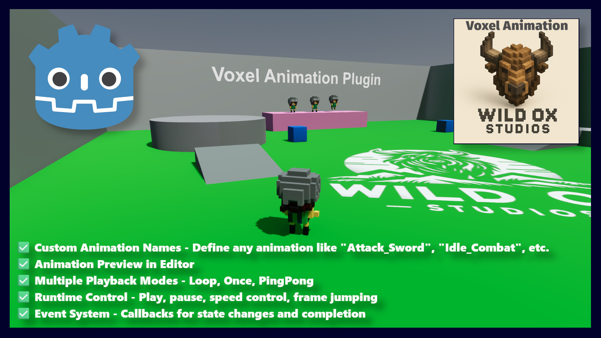

# Voxel Animation



Frame-by-frame static mesh swap animation (voxel flipbook animation) for Godot 4, ported from the Wild Ox Studios Unreal Engine VoxelAnimation plugin.

Instead of skeletal/skin animation, each frame is a separate mesh (e.g. a voxel model exported per-pose). `VoxelAnimationPlayer` ticks a timer and swaps the mesh on a target `MeshInstance3D` each frame — the 3D equivalent of a 2D sprite-sheet flipbook.

## Installation

1. Copy `addons/voxel_animation` into your project's `addons/` folder.
2. Enable **Voxel Animation** under **Project > Project Settings > Plugins**.

## Concepts

- **VoxelAnimationSequence** (`Resource`) — one named animation (e.g. `"Walk"`). Holds an ordered `frames` array of `PackedScene` (glTF/glb exports work well), a `frame_rate`, and a `play_mode` (`LOOP`, `ONCE`, `PING_PONG`). The mesh is extracted from each frame scene's first `MeshInstance3D` and cached.
- **VoxelAnimationLibrary** (`Resource`) — a set of `VoxelAnimationSequence`s, shareable across characters/scenes, looked up by `animation_name`.
- **VoxelAnimationPlayer** (`Node`) — plays a library's sequences onto a `target_mesh_instance`. Runs as `@tool`, so assigning a library/target or scrubbing `current_frame_index` previews live in the editor viewport without pressing play.

## Usage

1. Create a `VoxelAnimationSequence` resource per animation, add your per-frame mesh scenes to `frames`, and set `frame_rate` / `play_mode`.
2. Create a `VoxelAnimationLibrary` resource and add your sequences to it.
3. Add a `VoxelAnimationPlayer` node to your character scene, assign `library` and `target_mesh_instance`.
4. Set `autostart_animation` (defaults to `"Idle"`) or call `play()` from code:

```gdscript
$VoxelAnimationPlayer.play(&"Walk")
$VoxelAnimationPlayer.stop()
$VoxelAnimationPlayer.pause(true)
$VoxelAnimationPlayer.set_playback_speed(1.5)
```

### Signals

- `animation_state_changed(old_animation, new_animation)`
- `animation_finished(completed_animation)` — emitted once for `ONCE` play mode
- `frame_changed(old_frame, new_frame)`

## Demo

See `addons/voxel_animation/demo/` for a working example character and level scene.

## License

See [LICENSE](LICENSE).
